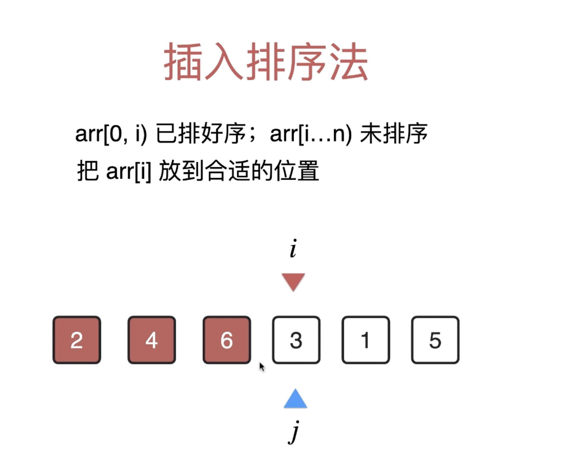

# 插入排序

## 生活场景：

扑克牌、麻将（同花色）

抓一手（5，8，7，10，9），从第一个开始比较：

8 > 5 位置不变

7 < 8 && 7 > 5 所以移动7：578109（人脑很容易处理这种区间情况，但是计算机是按步运算，所以只能西安比较7&8，再比较7&5一步步完成）

10 > 8 位置不变

9 < 10 移动9：578910

以上即插入排序。

## 循环不变量

arr[0, i) 已排好序，arr[i, ..., n) 未排序

## 优势

插入排序相比选择排序的提高在于，当数组完全有序的情况下，插入排序复杂度为O(n)而选择排序不变，但复杂度讲究一个最坏🤣所以还是O(n^2)但也算是进步了

解决实际问题时要注意应用这个特点，如果要处理一个几乎有序的数组，插入排序是最佳选择

要特别理解的是，数学家们将扫描全序列巧妙的转化为扫描子序列的思想